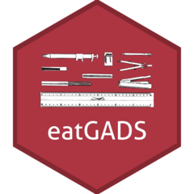

# eatGADS <a href="https://beckerbenj.github.io/eatGADS/"></a>

<!-- badges: start -->
[](https://CRAN.R-project.org/package=eatGADS)
[](https://github.com/beckerbenj/eatGADS/actions)
[](https://app.codecov.io/gh/beckerbenj/eatGADS?branch=master)
[](https://cran.r-project.org/package=eatGADS)

<!-- badges: end -->

## Overview

`eatGADS` (educational assessment tools: Greatest Assumable Data Set) is the data management and data handling tool used by the Institute for Educational Quality Improvement in Germany ([IQB](https://www.iqb.hu-berlin.de/)). It has a strong focus on (automated) handling and processing of meta data. 

`eatGADS` uses [`SQLite3`](https://www.sqlite.org/index.html) as a back end and is especially suited for importing data stored as `SPSS` files. [`eatDB`](https://github.com/beckerbenj/eatDB) is used for data base creation and use, [`haven`](https://github.com/tidyverse/haven) is used for importing `SPSS` files.

## Installation

```R
# Install stable version from CRAN via
install.packages("eatGADS")

# Install development version from GitHub via
remotes::install_github("beckerbenj/eatGADS")
```

## Usage

The functionality of `eatGADS` is extensively documented in its various vignettes. If you have questions regarding existing functionality or requests for new features, contact the package author.

```R
# import SPSS data
sav_path <- system.file("extdata", "pisa.zsav", package = "eatGADS")
gads_obj <- import_spss(sav_path)

# see names of variables in the data set
namesGADS(gads_obj)

# extract meta data for specific variables
extractMeta(gads_obj, vars = c("schtype", "idschool"))

# extract data for data analysis while applying missing tags and value labels
dat1 <- extractData2(gads_obj)
```
