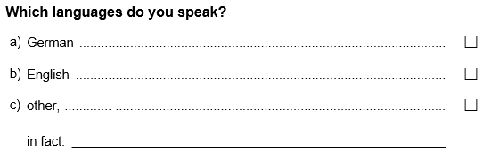
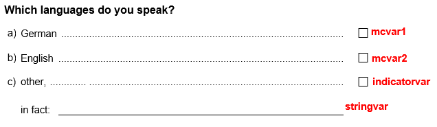

--- 
title: "Recoding a character variable with multiple possible values"
author: "Benjamin Becker, Johanna Busse"
date: "`r Sys.Date()`"
output: rmarkdown::html_vignette
vignette: >
  %\VignetteIndexEntry{Recoding a character variable with multiple possible values}
  %\VignetteEngine{knitr::rmarkdown}
  %\VignetteEncoding{UTF-8}
---

```{r, include = FALSE}
knitr::opts_chunk$set(
  collapse = TRUE,
  comment = "#>"
)
```

If a multiple choice item is administered, sometimes not all possible answers can be covered by predefined response options. In such cases, often an additional response option (e.g. "other") is given accompanied by an open text field. 

A string variable in a `GADS` object can be recoded into excisting numeric variables. For example if you have binary variables with the data of a multiple choice question (also an indicator variable whether there should be a string variable) and another one with additional possibilities as strings. With the following steps you can integrate the additional information into the existing ones and make an extra one with the additional information.   
  
To illustrate the steps we will create a very simple `GADS` example.


With this multiple choice question you can get a `GADS` like the following one.

```{r setup}
library(eatGADS)
#create example GADS
dat <- data.frame(ID = 1:10, mcvar1 = c("yes", "yes", "no", "no", "no", NA, NA, NA, "yes", "no"),
                  mcvar2 = c("yes", NA, "no", "no", "yes", "yes", NA, NA, "no", "no"),
                  indicatorvar = c("yes", NA, "no", "yes", "yes", "yes", NA, NA, "no", "no"),
                  stringvar = c(NA, "Italian, Eng, Polish", "English, Germ", "Ita, Polish", 
                                "Eng, Germ", "Ger, Italian", "Germ", "Polish", NA, "Eng"),
                  stringsAsFactors = TRUE)
dat$stringvar <- as.character(dat$stringvar)
gads <- import_DF(dat)

gads$labels$varLabel <- c("ID", "German", "German", "English", "English", "extra", "extra", "extra")

values_mc <- c("no", "yes")
names(values_mc) <- c(0, 1)

gads <- recodeGADS(GADSdat = gads, varName = "mcvar1", oldValues = c(1, 2), newValues = c(0, 1), 
                   newValueLabels = values_mc)
gads <- recodeGADS(GADSdat = gads, varName = "mcvar2", oldValues = c(1, 2), newValues = c(0, 1), 
                   newValueLabels = values_mc)
gads <- recodeGADS(GADSdat = gads, varName = "indicatorvar", oldValues = c(1, 2), newValues = c(0, 1), 
                   newValueLabels = values_mc)
```



In case you're importing an external data set you may have empty strings that are not formatted as an `NA`. In this case you can use the `recodeString2NA()` function.

## Creating and editing a lookup table

With `createLookup()` you can create a lookup table that shows you all unique strings of one variable.  
You can choose which string variables in a `GADS` object you would like to recode by using the `recodeVars` argument. In case you want you have the possibility to sort (`sort_by`) the column and to add some extra coloumns (`addCols`). You add as many columns as you need to fill in all possible values that contains one string.

```{r lookup}
lookup <- createLookup(GADSdat = gads, recodeVars = "stringvar", sort_by = 'value', 
                       addCols = c("language", "language2", "language3"))

lookup
```

Now you can fill in the wanted recoded values for the strings. You should use the existing values of the multiple choice variables (or where you want the string variable to be integrated) and consistent new ones. Take care that you use the same spelling. Every Value is by itself in a column. Later you can choose how many new variables you want to create. If there are too many values for one ID they become a missing value. If there are less values than columns you can leave them as NA.   
To fill in the columns you can use R (see the example) or you can use `eatAnalysis::write_xlsx()` and `readxl::read_xlsx()` for an additional excel file where you can fill in the values. 

```{r editing lookup}
lookup
lookup$language <- c("missing", "English", "English", "English", "German", "German", "Italian", 
                     "Italian", "Polish")
lookup$language2 <- c(NA, NA, "German", "German", "Italian", NA, "Polish", "English", NA)
lookup$language3 <- c(NA, NA, NA, NA, NA, NA, NA, "Polish", NA)

lookup
```


The next step is to prepare the recoding part. For that you need a named character vector containing the binary variables and expressions that are also used in the lookup table in the variable label to identify them.  
The function `matchValues_varLabels()` helps to get the right output. In case that not every already existing variable label is part of the lookup table you can use the `label_by_hand` argument.

```{r named character vector, error=TRUE}
value_string <- c(lookup$language, lookup$language2, lookup$language3)
named_char_vec <- matchValues_varLabels(GADSdat = gads, mc_vars = c("mcvar1", "mcvar2", "indicatorvar"), 
                                        values = value_string, label_by_hand = c("extra"="indicatorvar"))
```

Now you can integrate the lookuptable into the `GADS` object by using `applyLookup_expandVar()`. You will get as many extra string variables as you have extra columns. They are named after the numbered string variable.  

```{r integrate the Lookup table}
gads_string <- applyLookup_expandVar(GADSdat = gads, lookup = lookup)

gads_string$dat
```

By using the expanded `GADS` and the named character vector you can collapse the information of the strings with the already existing numeric variables. For that the binary numeric variables must have the structure: 1 = true and 0 = false. If there is a match of a string and a numeric variable but its set to 0 the function will set it to 1 and if it is the only string value the indicator variable will be set to 0. You also need a vector of the new built string variables in the `GADS` object for the `text_vars` argument.  
DIE MISSINGSETZUNG HIER DANN NOCHMAL MIT AKTUALISIEREN

```{r collapse, error=TRUE}
gads_string2 <- collapseMultiMC_Text(GADSdat = gads_string, mc_vars = named_char_vec, 
                                     text_vars = c("stringvar_1", "stringvar_2", "stringvar_3"), 
                                     mc_var_4text = "indicatorvar", var_suffix = "_r", 
                                     label_suffix = "(recoded)")

gads_string2$dat
```

Now you only have unique new values in the string variables left. By using the `multiChar2fac()` function they will turn to numeric variables and after that `checkMissings()` helps to define the missing codes.  
Then you can use `remove_2NA_char()` to decide how many variables you finally want to have(`max_num`). If there are more values for one ID there will be a missing code for all cases that you can define with `na_value`.

```{r final recoding, error=TRUE}
gads_numeric <- multiChar2fac(GADSdat = gads_string2, vars = c("stringvar_1", "stringvar_2"), 
                              var_suffix = "_r", label_suffix = "(recoded)")

gads_numeric$dat

gads_numeric <- checkMissings(GADSdat = gads_numeric, missingLabel = "missing", addMissingCode = TRUE)

gads_final <- remove_2NA_char(GADSdat = gads_numeric, vars = c("stringvar_1_r", "stringvar_2_r"), 
                              max_num = 2, na_value = -1)

gads_final$dat
```

In a last step you can remove unnecessary variables from the `GADS` object by using `removeVars()`.
