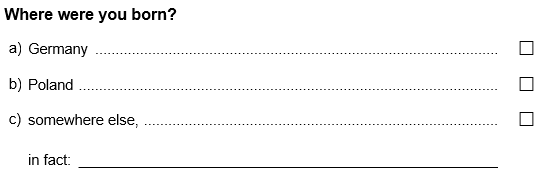
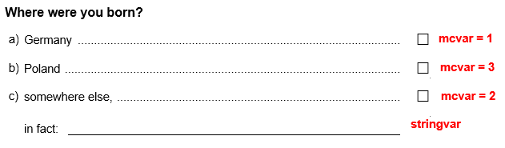

--- 
title: "Recoding a character variable with only one possible value"
author: "Benjamin Becker, Johanna Busse"
date: "`r Sys.Date()`"
output: rmarkdown::html_vignette
vignette: >
  %\VignetteIndexEntry{Recoding a character variable with only one possible value}
  %\VignetteEngine{knitr::rmarkdown}
  %\VignetteEncoding{UTF-8}
---

```{r, include = FALSE}
knitr::opts_chunk$set(
  collapse = TRUE,
  comment = "#>"
)
```

If a multiple choice item is administered, sometimes not all possible answers can be covered by predefined response options. In such cases, often an additional response option (e.g. "other option", "something else", ...) is given accompanied by an open text field. An example of such a multiple choice item is given below.

&nbsp;



&nbsp;

However, in the resulting data set such an item will often be stored as two separate variables: a numeric variable with value labels (containing the existing response options) and a character variable (containing the answers in the text field). For data analysis, often a single numerical and labeled variable is desirable. Often, the following steps are required:

* recode the character variable manually (e.g. to eliminate spelling mistakes)
* transform open answers which refer to existing response options (e.g. if a test taker overlooked a response option)
* summarize both remaining variables into a single numerical, labeled variable

To illustrate the steps we will create a very simple `GADS` example.

```{r setup}
library(eatGADS)
#create example GADS
dat <- data.frame(ID = 1:10, mcvar = c("other", "Poland", "other", "other", "other", NA, 
                                       "Germany", "Poland", "other", "other"),
                  stringvar = c(NA, "Italy", "England", "Ita", "Eng", "German", "Germ", 
                                NA, "", "Eng"),
                  stringsAsFactors = TRUE)
dat$stringvar <- as.character(dat$stringvar)
gads <- import_DF(dat)
extractMeta(gads)
```

The variable names of the data set above are connected to the multiple choice question as the following:

&nbsp;



## Preparing the data set

Depending on the format, data can be loaded into `R` in the `GADSdat` format via the functions `import_spss()`,`import_DF()` or `import_raw()`. Depending on the original format, omitted responses to open text fields might be stored as empty strings instead of `NAs`. In these cases, the `recodeString2NA()` function should be used to recode these values to `NA`.

```{r recodeString2NA}
gads <- recodeString2NA(gads, string = "")
```


## Creating and editing a lookup table

With `createLookup()`, you can create a lookup table which allows recoding one or multiple variables..  
You can choose which string variables in a `GADS` object you would like to recode by using the `recodeVars` argument. In case you want to sort the output to make recoding easier, the argument `sort_by` can be used. Extra columns can be added to the look up table by the argument `addCols`.

```{r lookup}
lookup <- createLookup(GADSdat = gads, recodeVars = "stringvar", sort_by = 'value', 
                       addCols = c("new", "new2"))

lookup
```

Now you have to add the desired values for recoding. You should use the existing value labels of the corresponding numerical, labeled variable and consistent new ones. Take care to use the same spelling, otherwise different values will result!   
To fill in the columns you can use R (see the example). Alternatively, you can use `eatAnalysis::write_xlsx()` to create an excel file in which you can fill in the values. The excel file can be read in back to R via `readxl::read_xlsx()`.

If you have more than one person working on the variable or if you want to use templates, you may have 2 different possible values for the unique strings. You can fill in both in the lookup table (for example: `new` and `new2`) and then choose which one you want to prioritize later.

```{r fill in values}
lookup
lookup$new <- c("missing", "England", NA, "Germany", "Germany", NA, "Italy")
lookup$new2 <- c("miss", "England", "England", NA, "Germany", "Italy", "Italy")
lookup
```

You can use the `collapseColumns()` function to get the correct layout and to merge both columns containing the new values. By using the `prioritize` argument you can decide which column will be preferred. Only if there is an `NA` the other one will be used instead.

```{r collapse the columns}
lookup_formatted <- collapseColumns(lookup = lookup, recodeVars = c("new", "new2"), prioritize = "new")
lookup_formatted
```


## Integrate the lookup table into the `GADS`

First of all you can integrate the `value_new` column in the `GADS` as a string variable by using the `applyLookup()` function. If you use a `suffix`, the old variable wont be overwritten.

  
```{r integrate the Lookup table}
gads_string <- applyLookup(GADSdat = gads, lookup = lookup_formatted, suffix = "_r")

gads_string$dat
```

The next step is to integrate the string variable into the integer via the `collapse_MCText()` function. The new value labels will be alphabetical ordered after the already existing ones. 
With the `mc_code4text` argument you can choose the value that signals that you want to use the new value (beside `NA`).  
`checkMissings()` is a function for setting Missing Values.

```{r collapse the data}
gads_final <- collapseMC_Text(GADSdat = gads_string, mc_var = "mcvar", text_var = "stringvar_r", 
                              mc_code4text = "other", var_suffix = "_r", label_suffix = "(recoded)")

gads_final$dat
extractMeta(gads_final, "mcvar_r")
gads_final <- checkMissings(GADSdat = gads_final, missingLabel = "missing", 
                            addMissingCode = TRUE, addMissingLabel = FALSE)
extractMeta(gads_final, "mcvar_r")
```

In a last step you can remove unnecessary variables from the `GADS` object by using `removeVars()`.

```{r removing unnecessary variables}
gads_final <- removeVars(GADSdat = gads_final, vars = c("mcvar", "stringvar_r"))
gads_final$dat
```
