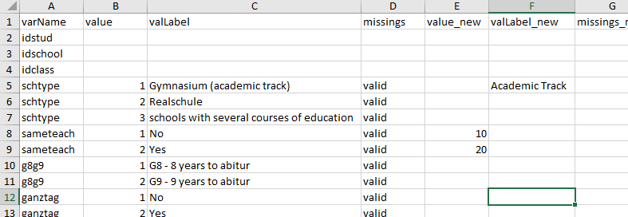

--- 
title: "Comprehensive Data Cleaning Guide"
author: "Benjamin Becker, Marlen Holtmann, Johanna Busse"
date: "`r Sys.Date()`"
output: rmarkdown::html_vignette
vignette: >
  %\VignetteIndexEntry{Comprehensive Data Cleaning Guide}
  %\VignetteEngine{knitr::rmarkdown}
  %\VignetteEncoding{UTF-8}
---

```{r, include = FALSE}
knitr::opts_chunk$set(
  collapse = TRUE,
  comment = "#>"
)
```

```{r setup2, echo = FALSE}
options(width = 100)
library(eatGADS)
gads <- pisa
```

`eatGADS` allows importing data from `SPSS` files basically without any loss of data or meta data. 
`eatGADS` stores these data and meta data in so-called `GADSdat` objects. These objects are lists of length two, containing both the data (`"dat"`) as well as the meta data (`"labels"`).

```{r GADSdat, echo = TRUE}
class(pisa)
names(pisa)
```

As `GADSdat` objects have this specific structure, conventional data modification tools are not suitable for `GADSdat` objects. Instead, `eatGADS` provides designated data cleaning and data wrangling functions for most common data cleaning and data wrangling tasks. This is especially relevant for data cleaning steps that require simultaneous modification of both the data and the meta data (e.g., recoding of values and value labels).

In this vignette 

* the structure of `GADSdat`objects is illustrated and 
* common data cleaning and data wrangling are explained. 

For illustrative purposes, a small example data set from the campus files of the German PISA Plus assessment (called `pisa`) is used. The complete campus files and the original data set can be accessed [here](https://www.iqb.hu-berlin.de/fdz/Datenzugang/CF-Antrag/AntragsformularCF) and [here](https://www.iqb.hu-berlin.de/fdz/Datenzugang/SUF-Antrag). 

```{r setup, eval = FALSE}
library(eatGADS)
gads <- pisa
```


## Data structure

The raw data in a `GADSdat` object are represented as raw, unlabeled values. They can be accessed via `GADSdat$dat`. For the extraction of data suitable for data analyses, see the `extractData2()` function.

```{r data raw, echo = TRUE}
pisa$dat[1:5, 1:5]
```


## Meta data structure

Meta data are stored in a `GADSdat` object with the following structure: 

```{r meta raw, echo = FALSE}
extractMeta(gads, vars = c("gender"))
```

* `varLabel`: a variable label; describes a variable in the data
* `format`: the `SPSS` format of a variable; `F` represents numeric, `A` represents character variables
* `display_width`: the display width of a variable in the `SPSS` format
* `labeled`: does the variable contain value labels or missing tags?

On value level, additional meta data can be stored, namely:

* `valLabel`: value labels; labels describing, what a certain value on a certain variable represents
* `missings`: missing tags (sometimes also referred to as missing codes) indicating whether a certain value represents a valid (`"valid"`) or a missing (`"miss"`) value

Via the function `extractMeta()` the existing metadata of one, several or all variables in a `GADSdat` object can be inspected. This function is used frequently throughout the vignette to check whether changes to meta data have been performed successfully.

```{r overview}
extractMeta(gads, vars = c("hisei", "schtype"))
```

## Modifying meta data
This section discusses changes on meta data level, such as changes to variable names or labels.

#### Changing variable names
Changes to meta data on variable level are straightforward. Variable names can be changed with the `changeVarNames()` function. The old variable names are overwritten. Multiple variable names can be adjusted at once.

```{r names}
# inspect original meta data
extractMeta(gads, vars = "hisei")

# Change variable name
gads_labeled <- changeVarNames(GADSdat = gads, oldNames = "hisei", newNames = "hisei_new")

# inspect modified meta data
extractMeta(gads_labeled, vars = "hisei_new")
```

#### Changing variable labels
Variable labels can be adjusted analogously via the `changeVarLabels()` function. Again, multiple variable labels can be adjusted at once.

```{r varlabels}
extractMeta(gads_labeled, vars = "hisei_new")

# Change variable label 
gads_labeled <- changeVarLabels(GADSdat = gads_labeled, varName = "hisei_new", 
                                varLabel = "Parental occupational status (highest)")

extractMeta(gads_labeled, vars = "hisei_new")
```

#### Changing SPSS format
The same applies for the `SPSS` format of a variable using the `changeSPSSformat()` function.

```{r format}
extractMeta(gads_labeled, "hisei_new")

# Change SPSS format
gads_labeled <- changeSPSSformat(GADSdat = gads_labeled, varName = "hisei_new", 
                                 format = "F10.2")

extractMeta(gads_labeled, "hisei_new")
```


#### Changing value labels
Changes to meta data on value level follow the same principle. With the `changeValLabels()` function, value labels can be added or modified. Note that value labels and missing codes should be given to numeric values, even if a variable is a character variable.

```{r vallabels}
# Adding value labels
extractMeta(gads_labeled, "hisei_new")
gads_labeled <- changeValLabels(GADSdat = gads_labeled, varName = "hisei_new", 
                                value = c(-94, -99), valLabel = c("miss1", "miss2"))
extractMeta(gads_labeled, "hisei_new")

# Changing value labels
gads_labeled <- changeValLabels(GADSdat = gads_labeled, varName = "hisei_new", 
                                value = c(-94, -99), 
                                valLabel = c("missing: Question omitted",
                                             "missing: Not administered"))
extractMeta(gads_labeled, "hisei_new")
```

#### Removing value labels
Value labels can be deleted using the `removeValLabels()` function. 

```{r remove}
# Removing value labels
extractMeta(gads_labeled, "schtype")
gads_labeled <- removeValLabels(GADSdat = gads_labeled, varName = "schtype", 
                                value = 1:3)
extractMeta(gads_labeled, "schtype")
```


#### Changing missing tags
Missing tags (sometimes also referred to as missing codes) can be modified using the `changeMissings()` function. Valid entries for `missings` are `"miss"` and `"valid"`. 

```{r missings}
# Defining missings
extractMeta(gads_labeled, "hisei_new")
gads_labeled <- changeMissings(GADSdat = gads_labeled, varName = "hisei_new", 
                               value = c(-94, -99), missings = c("miss", "miss"))
extractMeta(gads_labeled, "hisei_new")
```

#### Checking and adjusting missing tags and value labels
Usually an alignment of value labels and missing codes is desirable. For example, in the variable `hisei_new` the value `-94` has received a missing tag and the value label `"missing: Questions omitted"`. To make these alignments easier, the functions `checkMissings()` and `checkMissingsByValues()` exist. `checkMissings()` allows searching for regular expressions in the value labels and comparing missing tags and vice versa. Per default, missing codes are automatically adjusted (`addMissingCode = TRUE`) and value label mismatches just reported (`addMissingLabel = FALSE`). `checkMissingsByValues()` allows searching for labeled values in a specific value range (e.g., `-50:-99`).

```{r checkMissings}
# Creating a new value label for a missing value but leaving the missing code as valid
gads_labeled <- changeValLabels(GADSdat = gads_labeled, varName = "gender", 
                                value = -94, valLabel = "missing: Question omitted")
# Creating a new missing code but leaving the value label empty
gads_labeled <- changeMissings(GADSdat = gads_labeled, varName = "gender", 
                                value = -99, missings = "miss")

# Checking value label and missing code alignment
gads_labeled2 <- checkMissings(gads_labeled, missingLabel = "missing") 

# Checking missing tags for a certain value range
gads_labeled <- checkMissingsByValues(gads_labeled, missingValues = -50:-99) 
```

#### Reusing meta data
Sometimes one variable already contains the meta data which should be added to another variable. `reuseMeta()` can copy meta data from one variable (`other_varName`) to another variable (`varName`), even across different data sets. The function allows us to transfer the complete meta data, only value labels or a specific selection of value labels (only valid values or missing codes). In the example below we transfer only the missing codes from variable `hisei_new` to variable `age`.

```{r reuse}
extractMeta(gads_labeled, "age")
gads_labeled <- reuseMeta(GADSdat = gads_labeled, varName = "age",
                          other_GADSdat = gads_labeled, other_varName = "hisei_new",
                          missingLabels = "only", addValueLabels = TRUE)
extractMeta(gads_labeled, "age")
```


## Adding and removing variables
In `GADSdat` objects, meta data is stored alongside with the actual data set. Therefore, changes to the actual data often imply changes to the meta data. If a variable is removed from the data set, its meta data is no longer needed. If a new variable is created, new meta data needs to be created. If a variable is recoded, the meta data entries need to be recoded accordingly.

#### Selecting or removing variables
If a certain subset of variables in the `GADSdat` is needed, individual variables can either be extracted via `extractVars()` or removed via `removeVars()`.

```{r select}
# Selecting variables
gads_motint <- extractVars(gads_labeled, 
                           vars = c("int_a", "int_b", "int_c", "int_d", "instmot_a"))
namesGADS(gads_motint)

gads_int <- removeVars(gads_motint, vars = "instmot_a") 
namesGADS(gads_int)
```

#### Cloning a variable
A variable can be cloned using the `cloneVariable()` function. Both the data and meta data are cloned. This function can be helpful if a modified copy of a variable should be created. For this purpose, the variable can be cloned and later modified (e.g., via `recodeGADS`).

```{r clone variable}
# Clone the variable "sameteach"
gads_labeled <- cloneVariable(gads_labeled, varName = "sameteach", new_varName = "sameteach2")
```

#### Adding variables
Adding variables to a `GADSdat` object is unfortunately not straight forward and requires utilizing the underlying object structure. For adding variables, the `dat` object needs to be abstracted and so that new variables ca be added to it. Afterwards, the meta data needs to be added using the `updateMeta()` function.

```{r add variables}
# Extract the data
newDat <- gads_labeled$dat
# Adding a variable
newDat$classsize_kat <- ifelse(newDat$classsize > 15, 
                                         yes = "big", no = "small") 
# Updating meta data
gads_labeled2 <- updateMeta(gads_labeled, newDat = newDat)
extractMeta(gads_labeled2, "classsize_kat")
```


## Recoding
`eatGADS` provides functionality for the manual and semi-automatic recoding of variables.

#### Removing all values from a variable
For instance for the purpose of ensuring the anonymity of person in a data set, it is sometimes desirable to empty sensitive variables. This can be performed using the `emptyTheseVariables()` function. 

```{r empty}
# Empty a variable completely
gads_labeled <- emptyTheseVariables(gads_labeled, vars = "idschool")
# Resulting frequency table
table(gads_labeled$dat$idschool, useNA = "ifany")
```


#### Manual recoding
The function `recodeGADS()` allows the manual recoding of a variable.

```{r recoding}
# Original data and meta data
gads_labeled$dat$gender[1:10]
extractMeta(gads_labeled, "gender")
# Recoding 
gads_labeled <- recodeGADS(GADSdat = gads_labeled, varName = "gender", 
                           oldValues = c(1, 2), newValues = c(10, 20))
# New data and meta data
gads_labeled$dat$gender[1:10]
extractMeta(gads_labeled, "gender")
```

Moreover, `recodeGADS()` allows recoding values without value labels or even `NA` values.

```{r recoding old NA}
# Recoding of NA values 
gads_labeled$dat$int_a[1:10]
gads_labeled <- recodeGADS(GADSdat = gads_labeled, varName = "int_a", 
                           oldValues = NA, newValues = -94)
gads_labeled$dat$int_a[1:10]
```

#### Setting values to NA
For recoding specific values into `NA` values, the function `recode2NA()` exists. It allows recoding a specific value across multiple variables (while `recodeGADS()` allows recoding multiple values for a single variable). Existing value labels for the specified values are deleted. For each variable it is reported how many cases have been recoded.

```{r recode2NA}
# Recoding of values as Missing/NA
gads_labeled$dat$schtype[1:10]
gads_labeled <- recode2NA(gads_labeled, recodeVars = c("hisei_new", "schtype"), 
                          value = "3")
gads_labeled$dat$schtype[1:10]
```

#### Automatically recoding a character variable to a labeled numeric variable
A character variable can be automatically recoded into a labeled numeric variable via `multiChar2fac()`.

```{r multiChar2fac}
# Example data set
test_df <- data.frame(id = 1:5, varChar = c("german", "English", 
                                            "english", "POLISH", "polish"),
                        stringsAsFactors = FALSE)
test_gads <- import_DF(test_df)

# Recoding a character variable to numeric
test_gads2 <- multiChar2fac(test_gads, vars = "varChar", var_suffix = "_new")
extractMeta(test_gads2, "varChar_new")
```

Via the argument `convertCase` upper and lower case can be automatically adjusted.

```{r multiChar2fac convertCase}
# Recoding a character variable to numeric while simplying case
test_gads2 <- multiChar2fac(test_gads, vars = "varChar", var_suffix = "_new",
                            convertCase = "upperFirst")
extractMeta(test_gads2, "varChar_new")
```

#### Automatically recoding a variable with a template
A variable can be automatically recoded into a labeled numeric variable via `autoRecode()`. This can be desirable, for instance, for the recoding of identifier variables.

```{r autorecode}
id_df <- data.frame(id = c(1101, 1102, 1103, 1104, 1105), 
                    varChar = c("german", "English", "english", "POLISH", "polish"),
                        stringsAsFactors = FALSE)
id_gads <- import_DF(id_df)

# Recoding a character variable to numeric
id_gads2 <- autoRecode(id_gads, var = "id", var_suffix = "_new")
id_gads2$dat[, c("id", "id_new")]
```

## Variable sorting
The sorting of variables in a `GADSdat` can be adjusted for individual variables and for the complete set of variables.

#### Relocating a specific variable
The function `relocateVariable()` allows the relocation of a single variable within a `GADSdat`.

```{r relocate}
namesGADS(gads_labeled)[1:5]

# Relocate a single variable within a the data set
gads_labeled <- relocateVariable(GADSdat = gads_labeled, var = "idschool",
                           after = "schtype")
namesGADS(gads_labeled)[1:5]

# Relocate a single variable to the beginning of the data set
gads_labeled <- relocateVariable(GADSdat = gads_labeled, var = "idschool",
                           after = NULL)
namesGADS(gads_labeled)[1:5]
```

#### Ordering all variables
The function `orderLike()` allows reordering all variables within a `GADSdat`.


## Changing meta data (and data) via an Excel sheet
So far, the introduced functions work well for modifying the meta data of small data sets or for individual variables. However, frequently we are interested in modifying the meta data of a larger number of variables simultaneously. For this purpose `eatGADS` provides a workflow that works well with Excel spreadsheets. Thereby changes to meta data are divided into two levels: the variable and the value level.


#### Variable level 
We start by extracting this change table via the `getChangeMeta()` function

```{r getChangeMeta}
# variable level
meta_var <- getChangeMeta(GADSdat = pisa, level = "variable")
```

While in principle one could modify the change table directly in R, it more convenient to do this in Excel. The change table can be written to `.xlsx` via the `eatAnalysis::write_xlsx()` function. To perform changes, entries are made into the corresponding "_new"-columns.

```{r write excel var, eval = FALSE}
# write to excel
eatAnalysis::write_xlsx(meta_var, row.names = FALSE, "variable_changes.xlsx")
```

&nbsp;


&nbsp;


The excel file can be read back into `R` via `readxl::read_xlsx()`. 

```{r read excel var, eval = FALSE}
# write to excel
meta_var_changed <- readxl::read_excel("variable_changes.xlsx", col_types = rep("text", 8))
```

```{r var changes under the hood, eval = TRUE, echo = FALSE, results='hide'}
meta_var_changed <- meta_var
meta_var_changed[4, "varName_new"] <- "schoolType"
meta_var_changed[1, "varLabel_new"] <- "Student Identifier Variable"
meta_var_changed[2, "format_new"] <- "F10.0"
```

The `applyChangeMeta()` function applies the meta data changes to the `GADSdat` object.

```{r applyChangeMeta}
gads2 <- applyChangeMeta(meta_var_changed, GADSdat = pisa)
extractMeta(gads2, vars = c("idstud", "idschool", "schoolType"))
```

#### Value level 
At value level, information on value, value labels or missings can be changed. The general workflow is identical

```{r valuelevel}
# value level
meta_val <- getChangeMeta(GADSdat = pisa, level = "value")
```

```{r write excel val, eval = FALSE}
# write to excel
eatAnalysis::write_xlsx(meta_val, row.names = FALSE, "value_changes.xlsx")
```


&nbsp;



&nbsp;

```{r read excel val, eval = FALSE}
# write to excel
meta_val_changed <- readxl::read_excel("value_changes.xlsx", 
                                       col_types = c("text", rep(c("numeric", "text", "text"), 2)))
```

```{r val changes under the hood, eval = TRUE, echo = FALSE, results='hide'}
meta_val_changed <- meta_val
meta_val_changed[4, "valLabel_new"] <- "Acamedic Track"
meta_val_changed[7:8, "value_new"] <- c(10, 20)
```


```{r applyvalue}
gads3 <- applyChangeMeta(meta_val_changed, GADSdat = pisa)
extractMeta(gads3, vars = c("schtype", "sameteach"))
```

