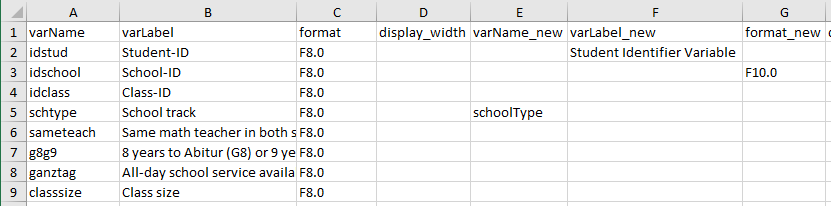
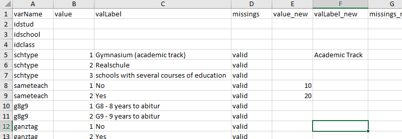

--- 
title: "Modifying Meta Data"
author: "Marlen Holtmann, Johanna Busse, Benjamin Becker"
date: "`r Sys.Date()`"
output: rmarkdown::html_vignette
vignette: >
  %\VignetteIndexEntry{Modifying Meta Data}
  %\VignetteEngine{knitr::rmarkdown}
  %\VignetteEncoding{UTF-8}
---

```{r, include = FALSE}
knitr::opts_chunk$set(
  collapse = TRUE,
  comment = "#>"
)
```

`eatGADS` allows importing data from `SPSS` files basically without any loss of meta data. Meta data are stored in a `GADSdat` object with the following structure: 

```{r meta raw, echo = FALSE}
options(width = 100)
library(eatGADS)
gads <- pisa
extractMeta(gads, vars = c("gender"))
```

* `varLabel`: a variable label; describing, what a variable in the data represents
* `format`: the `SPSS` format of a variable
* `display_width`: the display width of a variable in the `SPSS` format
* `labeled`: does the variable contain value labels or missing codes?

On value level, additional meta data can be stored, namely:

* `valLabel`: value labels; labels describing, what a certain value on a certain variable represents
* `missings`: missing codes indicating whether a certain value represents a valid (`"valid"`) or a missing (`"miss"`) value

These meta data provide an overview of the actual data and are essential to their understanding, comparable to a codebook. Most importantly, it also allows other researchers to understand the data without much effort and ensures transparency. In this vignette we will illustrate how in `eatGADS` meta data can be accessed and how it can be modified. We also discuss some recode and data modification functions that lead to automatic meta data changes. 

For illustrative purposes we use a small example data set from the campus files of the German PISA Plus assessment (called `pisa`). The complete campus files and the original data set can be accessed [here](https://www.iqb.hu-berlin.de/fdz/Datenzugang/CF-Antrag/AntragsformularCF) and [here](https://www.iqb.hu-berlin.de/fdz/Datenzugang/SUF-Antrag). 

```{r setup, eval = FALSE}
library(eatGADS)
gads <- pisa
```

## Meta data structure

With the function `extractMeta()` you can inspect the existing metadata of one, several or all variables in a `GADSdat` object. We will use this function frequently throughout the vignette to check whether changes to meta data have been successful.

```{r overview}
extractMeta(gads, vars = c("hisei", "schtype"))
```

## Modifying meta data

#### Variable names, labels, and SPSS format
Changes to meta data on variable level are straightforward. Variable names can be changed with the `changeVarNames()` function. The old variable names are overwritten.

```{r names}
# Changing variable names
extractMeta(gads, vars = "hisei")
gads_labeled <- changeVarNames(GADSdat = gads, oldNames = "hisei", newNames = "hisei_new")
extractMeta(gads_labeled, vars = "hisei_new")
```

Variable labels can be adjusted analogously via the `changeVarLabels()` function.

```{r varlabels}
# Changing variable labels 
extractMeta(gads_labeled, vars = "hisei_new")
gads_labeled <- changeVarLabels(GADSdat = gads_labeled, varName = "hisei_new", 
                                varLabel = "Parental occupational status (highest)")
extractMeta(gads_labeled, vars = "hisei_new")
```

The same applies for the `SPSS` format of a variable using the `changeSPSSformat()` function.

```{r format}
# Changing SPSS format
extractMeta(gads_labeled, "hisei_new")
gads_labeled <- changeSPSSformat(GADSdat = gads_labeled, varName = "hisei_new", 
                                 format = "F10.2")
extractMeta(gads_labeled, "hisei_new")
```


#### Value labels
Changes to meta data on value level follow the same principle. With the `changeValLabels()` function, value labels can be added or modified. Note that value labels and missing codes should be given to numeric values, even if a variable is a character variable.

```{r vallabels}
# Adding value labels
extractMeta(gads_labeled, "hisei_new")
gads_labeled <- changeValLabels(GADSdat = gads_labeled, varName = "hisei_new", 
                                value = c(-94, -99), valLabel = c("miss1", "miss2"))
extractMeta(gads_labeled, "hisei_new")

# Changing value labels
gads_labeled <- changeValLabels(GADSdat = gads_labeled, varName = "hisei_new", 
                                value = c(-94, -99), 
                                valLabel = c("missing: Question omitted",
                                             "missing: Not administered"))
extractMeta(gads_labeled, "hisei_new")
```

Value labels can also be deleted using the `removeValLabels()` function. 

```{r remove}
# Removing value labels
extractMeta(gads_labeled, "schtype")
gads_labeled <- removeValLabels(GADSdat = gads_labeled, varName = "schtype", 
                                value = 1:3)
extractMeta(gads_labeled, "schtype")
```


#### Missings
Missing codes can be modified using the `changeMissings()` function. Valid entries for `missings` are `"miss"` and `"valid"`. 

```{r missings}
# Defining missings
extractMeta(gads_labeled, "hisei_new")
gads_labeled <- changeMissings(GADSdat = gads_labeled, varName = "hisei_new", 
                               value = c(-94, -99), missings = c("miss", "miss"))
extractMeta(gads_labeled, "hisei_new")
```

Usually an alignment of value labels and missing codes is desirable. For example, in our variable `hisei_new` the value `-94` has received a missing code and the value label `"missing: Questions omitted"`. To make these alignments easier, the `checkMissings()` function exists. It allows searching for regular expressions in the value labels and comparing missing codes and vice versa. Per default, missing codes are automatically adjusted (`addMissingCode = TRUE`) and value label mismatches just reported (`addMissingLabel = FALSE`). 

```{r checkMissings}
# Creating a new value label for a missing value but leaving the missing code as valid
gads_labeled <- changeValLabels(GADSdat = gads_labeled, varName = "gender", 
                                value = -94, valLabel = "missing: Question omitted")
# Creating a new missing code but leaving the value label empty
gads_labeled <- changeMissings(GADSdat = gads_labeled, varName = "gender", 
                                value = -99, missings = "miss")

# Checking value label and missing code allignment
gads_labeled <- checkMissings(gads_labeled, missingLabel = "missing") 
```

#### Reusing meta data
Sometimes one variable already contains the meta data which should be added to another variable. `reuseMeta()` can copy meta data from one variable (`other_varName`) to another variable (`varName`), even across different data sets. The function allows us to transfer the complete meta data, only value labels or a specific selection of value labels (only valid values or missing codes). In the example below we transfer only the missing codes from variable `hisei_new` to variable `age`.

```{r reuse}
extractMeta(gads_labeled, "age")
gads_labeled <- reuseMeta(GADSdat = gads_labeled, varName = "age",
                          other_GADSdat = gads_labeled, other_varName = "hisei_new",
                          missingLabels = "only", addValueLabels = TRUE)
extractMeta(gads_labeled, "age")
```


## Modifying data and meta data
Note that in `eatGADS` meta data is stored together with the actual data set. Therefore, changes to the actual data set imply changes to the meta data. If a variable is removed from the data set, its meta data is no longer needed. If a new variable is created, new meta data needs to be created. If a variable is recoded, the meta data entries need to be recoded accordingly.

#### Selecting variables
If a certain subset of variables in the `GADSdat` is needed, individual variables can either be extracted (`extractVars()`) or removed (`removeVars()`) from the data set.

```{r select}
# Selecting variables
gads_motint <- extractVars(gads_labeled, 
                           vars = c("int_a", "int_b", "int_c", "int_d", "instmot_a"))
namesGADS(gads_motint)

gads_int <- removeVars(gads_motint, vars = "instmot_a") 
namesGADS(gads_int)
```

#### Recoding values
The function `recodeGADS()` allows the recoding of a variable.

```{r recoding}
# Original data and meta data
gads_labeled$dat$gender[1:10]
extractMeta(gads_labeled, "gender")
# Recoding 
gads_labeled <- recodeGADS(GADSdat = gads_labeled, varName = "gender", 
                           oldValues = c(1, 2), newValues = c(10, 20))
# New data and meta data
gads_labeled$dat$gender[1:10]
extractMeta(gads_labeled, "gender")
```

Moreover, the variable allows recoding of values that were not assigned value labels or even `NA` values.

```{r recoding old NA}
# Recoding of NA values 
gads_labeled$dat$int_a[1:10]
gads_labeled <- recodeGADS(GADSdat = gads_labeled, varName = "int_a", 
                           oldValues = NA, newValues = -94)
gads_labeled$dat$int_a[1:10]
```

For recoding specific values into `NA` values, the function `recode2NA()` exists. It allows recoding a specific value across multiple variables (while `recodeGADS()` allows recoding multiple values for a single variable). Existing value labels for the specified values are deleted. For each variable it is reported how many cases have been recoded.

```{r recode2NA}
# Recoding of values as Missing/NA
gads_labeled$dat$schtype[1:10]
gads_labeled <- recode2NA(gads_labeled, recodeVars = c("hisei_new", "schtype"), 
                          value = "3")
gads_labeled$dat$schtype[1:10]
```

#### Adding variables
Adding variables to a `GADSdat` object is unfortunately not straight forward and requires some understanding of the underlying object structure. A `GADSdat` object is basically a list with two entries, the data (`dat` ) and the meta data (`labels`). For adding variables we need to extract the `dat` object and add the new variables to it. Afterwards, we need to update the meta data using the `updateMeta()` function.

```{r add variables}
# Extract the data
newDat <- gads_labeled$dat
# Adding a variable
newDat$classsize_kat <- ifelse(newDat$classsize > 15, 
                                         yes = "big", no = "small") 
# Updating meta data
gads_labeled2 <- updateMeta(gads_labeled, newDat = newDat)
extractMeta(gads_labeled2, "classsize_kat")
```


## Changing meta data (and data) via an Excel sheet
So far, the introduced functions work well for modifying the meta data of small data sets or for individual variables. However, frequently we are interested in modifying the meta data of a larger number of variables simultaneously. For this purpose `eatGADS` provides a workflow that works well with Excel spreadsheets. Thereby changes to meta data are divided into two levels: the variable and the value level.


#### Variable level 
We start by extracting this change table via the `getChangeMeta()` function

```{r getChangeMeta}
# variable level
meta_var <- getChangeMeta(GADSdat = pisa, level = "variable")
```

While in principle one could modify the change table directly in R, it more convenient to do this in Excel. The change table can be written to `.xlsx` via the `eatAnalysis::write_xlsx()` function. To perform changes, entries are made into the corresponding "_new"-columns.

```{r write excel var, eval = FALSE}
# write to excel
eatAnalysis::write_xlsx(meta_var, row.names = FALSE, "variable_changes.xlsx")
```

&nbsp;



&nbsp;


The excel file can be read back into `R` via `readxl::read_xlsx()`. 

```{r read excel var, eval = FALSE}
# write to excel
meta_var_changed <- readxl::read_excel("variable_changes.xlsx", col_types = rep("text", 8))
```

```{r var changes under the hood, eval = TRUE, echo = FALSE, results='hide'}
meta_var_changed <- meta_var
meta_var_changed[4, "varName_new"] <- "schoolType"
meta_var_changed[1, "varLabel_new"] <- "Student Identifier Variable"
meta_var_changed[2, "format_new"] <- "F10.0"
```

The `applyChangeMeta()` function applies the meta data changes to the `GADSdat` object.

```{r applyChangeMeta}
gads2 <- applyChangeMeta(meta_var_changed, GADSdat = pisa)
extractMeta(gads2, vars = c("idstud", "idschool", "schoolType"))
```

#### Value level 
At value level, information on value, value labels or missings can be changed. The general workflow is identical

```{r valuelevel}
# value level
meta_val <- getChangeMeta(GADSdat = pisa, level = "value")
```

```{r write excel val, eval = FALSE}
# write to excel
eatAnalysis::write_xlsx(meta_val, row.names = FALSE, "value_changes.xlsx")
```


&nbsp;



&nbsp;

```{r read excel val, eval = FALSE}
# write to excel
meta_val_changed <- readxl::read_excel("value_changes.xlsx", 
                                       col_types = c("text", rep(c("numeric", "text", "text"), 2)))
```

```{r val changes under the hood, eval = TRUE, echo = FALSE, results='hide'}
meta_val_changed <- meta_val
meta_val_changed[4, "valLabel_new"] <- "Acamedic Track"
meta_val_changed[7:8, "value_new"] <- c(10, 20)
```


```{r applyvalue}
gads3 <- applyChangeMeta(meta_val_changed, GADSdat = pisa)
extractMeta(gads3, vars = c("schtype", "sameteach"))
```

