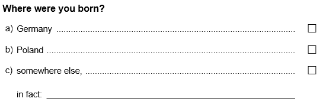
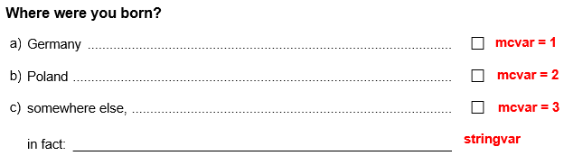
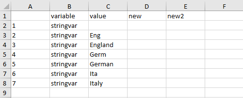
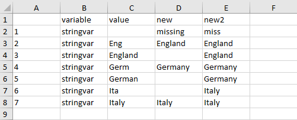

--- 
title: "Recoding a forced choice item with a text field"
author: "Benjamin Becker, Johanna Busse"
date: "`r Sys.Date()`"
output: rmarkdown::html_vignette
vignette: >
  %\VignetteIndexEntry{Recoding a forced choice item with a text field}
  %\VignetteEngine{knitr::rmarkdown}
  %\VignetteEncoding{UTF-8}
---

```{r, include = FALSE}
knitr::opts_chunk$set(
  collapse = TRUE,
  comment = "#>"
)
```

Forced choice items are multiple choice items with exclusive answer options (only one option can be chosen). If a forced choice item is administered, sometimes not all possible answers can be covered by predefined response options. In such cases, often an additional response option (e.g. "other option", "something else", ...) is given accompanied by an open text field. An example of such a multiple choice item is asking for the birthplace of a person:

&nbsp;



&nbsp;

However, in the resulting data set such an item will often be stored as two separate variables: a numeric variable with value labels (containing the existing response options) and a character variable (containing the answers in the text field). For data analysis, usually a single numerical and labeled variable is desirable. Often the following steps are required:

* recode the character variable manually (e.g. to eliminate spelling mistakes)
* transform open answers which refer to existing response options (e.g. if a test taker overlooked a response option)
* summarize both remaining variables into a single numerical, labeled variable

To illustrate the steps we have implemented a small `SPSS` example data set in this package. The data set can be loaded using the `import_spss()` function. For further information on importing `SPSS` data see [`import_spss`: Importing data from 'SPSS'](import_spss.html). Note that the data set is a minimal working example, containing only the required variables for this illustration.

```{r setup}
library(eatGADS)
data_path <- system.file("extdata", "forcedChoice.sav", package = "eatGADS")
gads <- import_spss(data_path)

# Show example data set
gads
```

The variable names of the data set above are connected to the forced choice question as indicated:

&nbsp;



## Preparing the data set

As illustrated, data can be loaded into `R` in the `GADSdat` format via the functions `import_spss()`, `import_DF()` or `import_raw()`. Depending on the original format, omitted responses to open text fields might be stored as empty strings instead of `NAs`. In these cases, the `recodeString2NA()` function should be used to recode these values to `NA`. Per default, matching strings across all variables in the data set are recoded. Specific variables selection can be specified using the `recodeVars` argument. Note that the function only performs recodings to exact matches of a single, specific string (in our example `""`).

```{r recodeString2NA}
gads <- recodeString2NA(gads, string = "")
```


## Creating and editing a lookup table

With `createLookup()`, you can create a lookup table which allows recoding one or multiple variables.  
You can choose which string variables in a `GADS` object you would like to recode by using the `recodeVars` argument. The resulting look up table is a long format `data.frame` with rows being variable x value pairings. In case you want to sort the output to make recoding easier, the argument `sort_by` can be used. Extra columns can be added to the look up table by the argument `addCols` (but can also be added later manually e.g. in Excel). The respective column names are irrelevant and just for convenience purpose. 

```{r lookup}
lookup <- createLookup(GADSdat = gads, recodeVars = "stringvar", sort_by = 'value', 
                       addCols = c("new", "new2"))

lookup
```

Now you have to add the desired values for recoding. You should use (a) the existing value labels of the corresponding numerical, labeled variable and (b) consistent new values that can serve as value labels later. Spelling mistakes within the recoding will result in different values in the output!   
To fill in the columns you could use `R` directly to modify the columns. Alternatively, we recommend using `eatAnalysis::write_xlsx()` to create an excel file in which you can fill in the values. 

```{r lookup export, eval=FALSE}
# write look up table to Excel
eatAnalysis::write_xlsx(lookup, "lookup_forcedChoice.xlsx")
```



&nbsp;

After filling out the excel sheet the look up table might look like this: 

&nbsp;



&nbsp;

The excel file can be read back into `R` via `readxl::read_xlsx()`. Detailed information on how missing values should be recoded is provided in the last section of this vignette.

If you have more than one person working on the variable or if you want to use templates, you may have 2 different possible recode values (in our example: `new` and `new2`) . You can fill in both in the lookup table and then choose which one you want to prioritize later.

```{r lookup reimport, eval=FALSE}
# read look up table back to R
lookup <- readxl::read_xlsx("lookup_forcedChoice.xlsx")
lookup
```

```{r fill in values, echo=FALSE}
lookup$new <- c("missing", "England", NA, "Germany", "Germany", NA, "Italy")
lookup$new2 <- c("miss", "England", "England", NA, "Germany", "Italy", "Italy")
lookup
```

We use the `collapseColumns()` function to get the correct layout for the final look up table. The function merges both columns containing the new values. By using the `prioritize` argument you can decide which column will be preferred. Only if there is an `NA` in the prioritized column, the other column will be used instead.

```{r collapse the columns}
lookup_formatted <- collapseColumns(lookup = lookup, recodeVars = c("new", "new2"), 
                                    prioritize = "new")
lookup_formatted
```


## Apply look up to `GADSdat`

You perform the actual data recoding using the `applyLookup()` function. It applies the recodes defined in the look up table. This means that if the look up table was created for multiple variables, `applyLookup()` performs recoding for all of these variables simultaneously. If you define a `suffix`, the old variable(s) will not be overwritten.

```{r integrate the Lookup table}
gads_string <- applyLookup(GADSdat = gads, lookup = lookup_formatted, suffix = "_r")

gads_string$dat
```

## Integrate character and numeric variable

The next step is to integrate the string variable into the integer via the `collapseMC_Text()` function. With `mc_var` and `text_var` we specify the variables used for recoding. With the `mc_code4text` argument we specify the value label of `mc_var` which indicates that `text_var` contains valid information (in our example `"other"`). If the `mc_var` is missing, `text_var` is also utilized (e.g. row 6). If there is a valid value in `mc_var` other than the code for `mc_code4text`, information in `text_var` is ignored (e.g. row 2). New value labels are created for entries in `text_var` without corresponding value labels. The new value labels are ordered alphabetically and inserted after the already existing ones. Additional information on how missings are treated by the function can be found in the last section of the vignette.

Note that in contrast to `createLookup()`, `collapseColumns()` and `applyLookup()` this function only works on a single forced choice variable pair. Integrating multiple variable pairs has to be performed in separate steps.


```{r collapse the data}
gads_final <- collapseMC_Text(GADSdat = gads_string, mc_var = "mcvar", 
                              text_var = "stringvar_r", mc_code4text = "other", 
                              var_suffix = "_r", label_suffix = "(recoded)")

gads_final$dat
extractMeta(gads_final, "mcvar_r")
```

`checkMissings()` is a function for automatically setting missing values in a `GADSdat`. If new values should receive missing codes, `checkMissings()` would be necessary. However, in our example no new values representing missings have been added, therefore the function does not change the `GADSdat`. 

```{r checkMissings}
gads_final <- checkMissings(GADSdat = gads_final, missingLabel = "missing", 
                            addMissingCode = TRUE, addMissingLabel = FALSE)
extractMeta(gads_final, "mcvar_r")
```


## Remove variables from `GADSdat`

In a last step you can remove intermediate or superfluous variables from the `GADSdat` by using the function `removeVars()`.

```{r removing unnecessary variables}
gads_final <- removeVars(GADSdat = gads_final, vars = c("mcvar", "stringvar_r"))
gads_final$dat
```


## Missing value codes

In some scenarios, there might be conceptual differences between missing codes in the data (e.g. invalid responses, item not administered, omission). These conceptual differences might require different integration of the two variables (numerical & labeled, character) depending on the type of missing. In this section, we illustrate how `collapseMC_Text()` behaves depending on how missings are defined in the data. 

To illustrate the described behavior, we have included an additional `SPSS` data set in the package with a forced choice variable pair including all possible value and missing combinations. The possible values in the string variable are `new valid`, indicating an arbitrary valid entry, `NA` indicating for example an omission and `special missing`, indicating for example an invalid entry.

```{r setup miss}
data_path_miss <- system.file("extdata", "forcedChoice_missings.sav", package = "eatGADS")
gads_miss <- import_spss(data_path_miss)
gads_miss <- recodeString2NA(gads_miss, string = "")

# Show example data set
gads_miss
```


If both variables have valid but contradicting entries, `collapseMC_Text()` prefers information from the numerical, labeled variable (e.g. row 2). If both entries are missing, the behavior of `collapseMC_Text()` depends on the missing type in the character variable. If the missing is indicated via an explicit missing definition (`special missing` in the example), this missing code is preferred to missing codes from the numerical, labeled variable (e.g. row 11). If the missing is indicated via an actual `NA` in the character variable, the information from the numerical, labeled variable is preferred (e.g. row 7).

```{r missing treatment}
# summarize numerical, labeled variable and character variable
gads <- collapseMC_Text(gads_miss, "mc", "string", mc_code4text = "other", "_r", "recoded")
gads$dat
```
