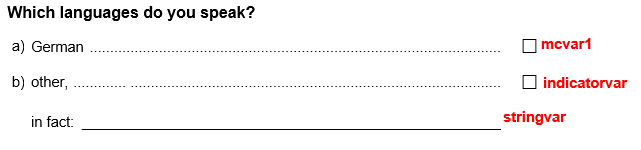
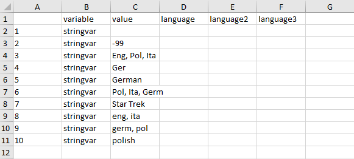

--- 
title: "Recoding a multiple choice item with a text field"
author: "Benjamin Becker, Johanna Busse"
date: "`r Sys.Date()`"
output: rmarkdown::html_vignette
vignette: >
  %\VignetteIndexEntry{Recoding a multiple choice item with a text field}
  %\VignetteEngine{knitr::rmarkdown}
  %\VignetteEncoding{UTF-8}
---

```{r, include = FALSE}
knitr::opts_chunk$set(
  collapse = TRUE,
  comment = "#>",
  error = FALSE
)
```

If a multiple choice item is administered, sometimes not all possible answers can be covered by predefined response options. In such cases, often an additional response option (e.g. "other") is given accompanied by an open text field. An example of such a multiple choice item is asking for the languages a person is able to speak:

&nbsp;


&nbsp;

In the resulting data set, such an item will often be stored as multiple separate variables: dichotomous and numeric ('dummy') variables for each multiple choice option (with variable labels describing the response option) and an additional character variable (containing the answers in the text field). For data analysis it is usually necessary to integrate the information from the character variable into the dummy variables. Often the following steps are required:

* recode the character variable manually (e.g. to eliminate spelling mistakes) and separate the answers into multiple variables
* transform open answers which refer to existing response options (e.g. if a test taker overlooked a response option)
* transform the remaining open answers to numeric, labeled variables

To illustrate the steps we have implemented a small `SPSS` example data set in this package. The data set can be loaded using the `import_spss()` function. For further information on importing `SPSS` data see [`import_spss`: Importing data from 'SPSS'](import_spss.html). Note that the data set is a minimal working example, containing only the required variables for this illustration.

```{r setup}
library(eatGADS)
data_path <- system.file("extdata", "multipleChoice.sav", package = "eatGADS")
gads <- import_spss(data_path)

# Show example data set
gads
```

The variable names of the data set above are connected to the multiple choice question as indicated:

&nbsp;



## Preparing the data set

As illustrated, data can be loaded into `R` in the `GADSdat` format via the functions `import_spss()`,`import_DF()` or `import_raw()`. Depending on the original format, omitted responses to open text fields might be stored as empty strings instead of `NAs`. In these cases, the `recode2NA()` function should be used to recode these values to `NA`. Per default, matching strings across all variables in the data set are recoded. Specific variables selection can be specified using the `recodeVars` argument. Note that the function only performs recodings to exact matches of a single, specific string (in our example `""`).

```{r recode2NA}
gads <- recode2NA(gads, value = "")
```


## Creating and editing a lookup table

With `createLookup()`, you can create a lookup table which allows recoding one or multiple variables.  
You can choose which string variables in a `GADS` object you would like to recode by using the `recodeVars` argument. The resulting look up table is a long format `data.frame` with rows being variable x value pairings. In case you want to sort the output to make recoding easier, the argument `sort_by` can be used. Extra columns can be added to the look up table by the argument `addCols` (but can also be added later manually e.g. in Excel). As test takers can insert multiple languages in the text field, you have to add multiple recode columns to the look up table. The respective column names are irrelevant and just for convenience purpose. 

```{r lookup}
lookup <- createLookup(GADSdat = gads, recodeVars = "stringvar", sort_by = 'value', 
                       addCols = c("language", "language2", "language3"))

lookup
```

Now you have to add the desired values for recoding. You should use (a) unique parts of the existing variable labels of the corresponding dummy variables (see the next section for explanation) and (b) consistent new values that can serve as variable labels later. Spelling mistakes within the recoding will result in additional columns in the final data set! If there are less values than columns you can leave the remaining columns `NA`.    

To fill in the columns you could use `R` directly to modify the columns. Alternatively, we recommend using `eatAnalysis::write_xlsx()` to create an excel file in which you can fill in the values. 

```{r lookup export, eval=FALSE}
# write look up table to Excel
eatAnalysis::write_xlsx(lookup, "lookup_forcedChoice.xlsx")
```



&nbsp;

After filling out the excel sheet the look up table might look like this: 

&nbsp;


&nbsp;

The excel file can be read back into `R` via `readxl::read_xlsx()`. 
If you want to create specific missing codes, you have to insert the desired (numerical!) missing codes into all columns (e.g. `-96` in the look up table below). The corresponding value labels will be assigned in a later step.

```{r lookup import export, eval=FALSE}
# write look up table to Excel
eatAnalysis::write_xlsx(lookup, "lookup_multipleChoice.xlsx")

### perform recodes in Excel sheet!

# read look up table back to R
lookup <- readxl::read_xlsx("lookup_multipleChoice.xlsx")
lookup
```

```{r editing lookup, echo = FALSE}
lookup$language <- c(NA, NA, "English", "German", "German", 
                     "Polish", -96, "English", "German", "Polish")
lookup$language2 <- c(NA, NA, "Polish", NA, NA, 
                      "Italian", -96, "Italian", "Polish", NA)
lookup$language3 <- c(NA, NA, "Italian", NA, NA, 
                      "German", -96, NA, NA, NA)
lookup
```

## Apply look up to `GADSdat`

You perform the actual data recoding using the `applyLookup_expandVar()` function. It applies the recodes defined in the look up table, thereby creating as many character variables as there are additional columns in the look up table. Variable names are generated automatically.

```{r integrate the Lookup table}
gads_string <- applyLookup_expandVar(GADSdat = gads, lookup = lookup)

gads_string$dat
```

In some cases you might have recoded some of the values to specific missing codes. These missing codes have to be now specified by hand as value labels that should be treated as missings. The function `changeValLabels()` is used to give specific value labels and the function `changeMissings()` attaches missing codes. The loop below performs the appropriate labeling and missing coding in a loop for all three new string variables.

```{r label missings from Lookup table}
for(nam in paste0("stringvar_", 1:3)) {
  gads_string <- changeValLabels(gads_string, varName = nam, 
                                 value = -96, valLabel = "Missing: Not codeable")
  gads_string <- changeMissings(gads_string, varName = nam, 
                                value = -96, missings = "miss")
}

gads_string$labels
```

## Match values to variable labels

When integrating character variables into multiple dummy variables, there has to be a clear correspondence between values in the character variable and dummy variables. `eatGADS` requires this information as a named character vector with the dummy variable names as values and values of the text variable as names. Such a vector can be automatically generated by the  `matchValues_varLabels()` function. The function takes a character vector (`values`) as input and matches all values in this vector to the variable labels of the dummy variables (`mc_vars`). We provide the content of the character variables as input for the `values` argument as these are all possible new values.

In case that not every already existing variable label is part of the lookup table you can use the `label_by_hand` argument. This is always the case for the variable representing the `other` response option but might be necessary for other response options as well. Alternatively, these values could be added to the `value_string` as well, to enable automatic matching.

```{r named character vector}
value_string <- c(lookup$language, lookup$language2, lookup$language3)
named_char_vec <- matchValues_varLabels(GADSdat = gads_string, 
                                        mc_vars = c("mcvar1", "mcother"), 
                                        values = value_string, 
                                        label_by_hand = c("other"="mcother"))
named_char_vec
```

## Integrate character and numeric variables

By using the expanded `GADS` and the named character vector you can collapse the information of the strings with the already existing numeric variables. The following coding of the binary numeric variables is required: `1` = true and `0` = false (for recoding see `recodeGADS()`). The names of the text variables are specified under `text_vars`. 

If there is an entry in the text variables that matches one of the binary numeric variables, this binary numeric variable will be set to `1`. The variable which indicates entries in the text variable (`mc_var_4text`) is recoded accordingly. If for a row all entries in the text variable can be recoded into the binary numeric variables, the `invalid_miss_code` is inserted into the text variables and `mc_var_4text` is changed to `0`. If there are valid entries beside the binary numeric variables `mc_var_4text` is set to `1`. If there were no valid entries in `text_vars` to begin with, `mc_var_4text` is left as is. All empty entries in the `text_vars` are assigned missing codes (`notext_miss_code`).

```{r collapse}
gads_string2 <- collapseMultiMC_Text(GADSdat = gads_string, mc_vars = named_char_vec, 
                                     text_vars = c("stringvar_1", "stringvar_2", "stringvar_3"), 
                                     mc_var_4text = "mcother", var_suffix = "_r", 
                                     label_suffix = "(recoded)",
                                     invalid_miss_code = -98, 
                                     invalid_miss_label = "Missing: By intention",
                                     notext_miss_code = -99, 
                                     notext_miss_label = "Missing: By intention")

gads_string2$dat
```

## Trim down variables

Sometimes the number of additional entries should be limited (as theoretically there can be infinite additional entries). This means that the number of character variables is 'trimmed'. `remove2NAchar()` performs this trimming. Via `max_num` the maximum number of text variables is defined and all text variables above this number are removed from the data set. If a row in the data set contains valid entries in on of the removed variables, a specific missing code (`na_value`) is inserted into this row on all remaining text variables.

```{r remove2NAchar}
gads_string3 <- remove2NAchar(GADSdat = gads_string2, 
                              vars = c("stringvar_1_r", "stringvar_2_r", "stringvar_3_r"), 
                              max_num = 2, na_value = -97, 
                              na_label = "missing: excessive answers")

gads_string3$dat
```

## Multiple character variables to labeled integers

After using `collapseMultiMC_Text()` (and `remove2NAchar()`), only new, additional values are left in the character variables. `multiChar2fac()` transforms these remaining text variables to numeric, labeled variables. All resulting labeled variables share the exact same value labels, which are sorted alphabetically.

```{r multiChar2fac}
gads_numeric <- multiChar2fac(GADSdat = gads_string3, vars = c("stringvar_1_r", "stringvar_2_r"), 
                              var_suffix = "_r", label_suffix = "(recoded)")

gads_numeric$dat

gads_final <- gads_numeric
extractMeta(gads_final)[, c("varName", "value", "valLabel", "missings")]
```

## Clean data set

In a last step you can remove unnecessary variables from the `GADS` object by using `removeVars()`.
```{r remove vars}
gads_final2 <- removeVars(gads_final, vars = c("stringvar_1", "stringvar_2", "stringvar_3",
                                               "stringvar_1_r", "stringvar_2_r"))
```
